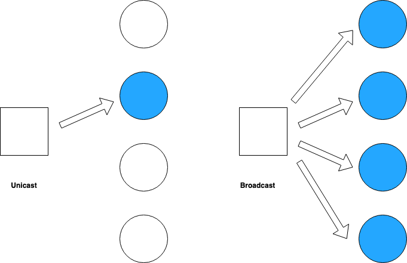

# elma-udp-comm
EE590_Final Project - A simple udp messenger supporting unicast & broadcast (C++)



Features
---
1. The communication can happen one-to-one (Unicast) or one-to-all.
2. Connection will be established using UDP protocol.
3. Only test message.
4. No authentication.

Installation
---

    git clone git@github.com:shantanusd/EE590_Project.git
    cd EE590_Project
    docker run -v $PWD:/source -it klavins/elma:latest bash
    make
    cd server
    make
    

Executable 
---

Start the server in a terminal:
```
    cd EE590_Project
    cd server
    docker run --name messenger-server -v $PWD:/source -it klavins/elma:latest bash
    bin/udp_server
```

Create a client in new terminal:
```
    cd EE590_Project
    docker run --name client1 --link messenger-server -v $PWD:/source -it klavins/elma:latest bash
    bin/udp_client
```


One can start multiple clients for multicast

Screenshot
===

Two terminals (server/client) should look like below - 


Resources
---
Elma Library
socket library

Bugs
---
1. The server/client connection fails arbitarily.
2. Multicast fails most of the time.

Milestones:
---
1. 03/12/2019 - Architecture bring-up.
2. 03/15/2019 - build server/client - unicast. 
3. 03/20/2019 - build server/client - multicast. 
4. 03/21/2019 - Test/Debug.
5. 03/23/2019 - Update Readme/docs/image; Final submission.
